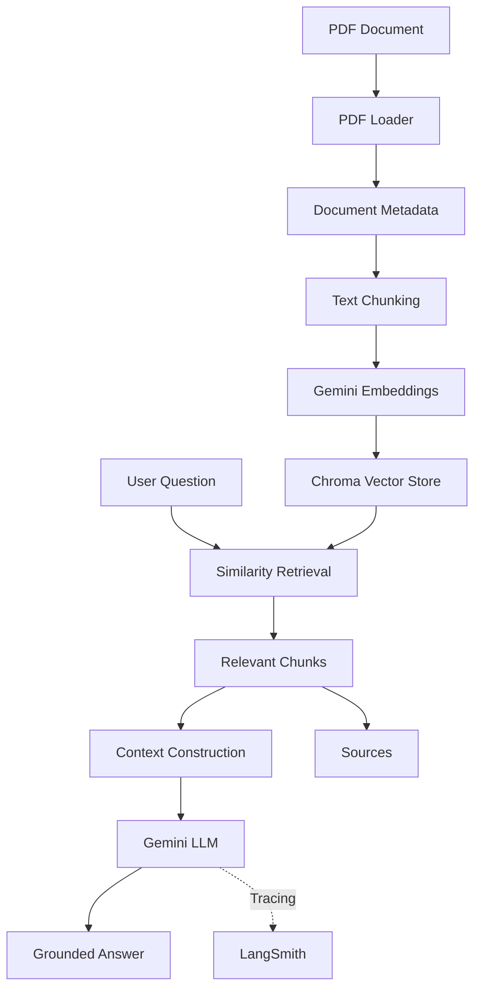

# Enterprise Documentation Assistant

An enterprise-style documentation assistant built around LLMs and Retrieval-Augmented Generation (RAG).

The project allows documentation such as PDFs to be ingested, processed into chunks, embedded into a vector store, and queried using natural language. The retrieved documentation is then provided to an LLM to generate grounded answers with source information.

The project is being built incrementally, with the focus on understanding the underlying architecture rather than putting every component into the project from the beginning.

## Current Features

- PDF document ingestion
- Document metadata extraction
- Recursive text chunking
- Google Gemini embeddings
- Chroma vector store
- Similarity-based retrieval
- Metadata-aware retrieval
- Retrieval relevance threshold
- Gemini-based answer generation
- Context-grounded responses
- Source information in responses
- LangGraph orchestration around the RAG flow
- FastAPI app wrapper for local query access
- Swagger/OpenAPI docs for local testing
- LangSmith tracing for LLM/RAG execution
- Environment-based configuration
- Pytest-based testing
- Ruff linting and formatting

## Current Architecture



## Technology Stack

### Backend and Language

- Python 3.12
- LangChain
- Pydantic Settings

### LLM and AI

- Google Gemini
- Gemini Embeddings
- LangSmith

### Retrieval

- Chroma
- Vector similarity search
- Metadata filtering

### Development

- uv
- pytest
- Ruff
- Git

## Project Structure

```text
enterprise-documentation-assistant/
│
├── app/
│   ├── api.py
│   ├── config.py
│   ├── cli.py
│   │
│   ├── llm/
│   │   ├── prompts.py
│   │   └── service.py
│   │
│   ├── langgraph/
│   │   ├── __init__.py
│   │   └── service.py
│   │
│   ├── ingestion/
│   │   ├── loader.py
│   │   ├── splitter.py
│   │   └── service.py
│   │
│   ├── embeddings/
│   │   └── service.py
│   │
│   ├── vector_store/
│   │   ├── chroma.py
│   │   └── service.py
│   │
│   ├── retrieval/
│   │   └── service.py
│   │
│   └── rag/
│       ├── prompts.py
│       ├── service.py
│       └── cli.py
│
├── tests/
│   ├── test_api.py
│   ├── test_config.py
│   ├── test_langgraph.py
│   └── ...
├── docs/
├── .env.example
├── .gitignore
├── LICENSE
├── README.md
├── pyproject.toml
└── uv.lock
```

The core RAG functionality is kept independent from the eventual HTTP API layer. This allows the ingestion, retrieval, and generation logic to be tested and executed without FastAPI.

## Configuration

Configuration is loaded through Pydantic Settings and environment variables.

Example:

```env
# LLM
LLM_PROVIDER=google
LLM_MODEL=gemini-2.5-flash
LLM_API_KEY=

# Embeddings
EMBEDDING_MODEL=gemini-embedding-001

# LangSmith
LANGSMITH_TRACING=true
LANGSMITH_API_KEY=
LANGSMITH_PROJECT=enterprise-documentation-assistant
```

The actual `.env` file is not committed to the repository.

## Running the Project

Install dependencies:

```bash
uv sync
```

Run the LLM example:

```bash
uv run python -m app.cli
```

Ingest a PDF:

```bash
uv run python -m app.ingestion.cli "path/to/document.pdf"
```

Run a retrieval query:

```bash
uv run python -m app.retrieval.cli "your question"
```

Run the RAG pipeline:

```bash
uv run python -m app.rag.cli "your question"
```

Run tests:

```bash
uv run pytest
```

Run linting:

```bash
uv run ruff check .
```

Start the FastAPI app locally:

```bash
uv run uvicorn app.api:app --reload
```

Then open the Swagger UI:

```text
http://127.0.0.1:8000/docs
```

### Swagger smoke test checklist

Test these in order from the Swagger UI:

1. `GET /health`
   - should return `{"status": "ok"}`
2. `POST /documents`
   - upload a small PDF or text file
   - confirm 201 response with `id`, `file_name`, `stored_name`, `mime_type`, and `uploaded_at`
3. `GET /documents`
   - confirm the uploaded document appears in the returned list
4. `DELETE /documents/{document_id}`
   - confirm the document is removed and the response contains `deleted: true`
5. `POST /query`
   - submit a question like `"What does this document say about agents?"`
   - confirm a valid answer payload with `answer`, `sources`, and `context`

Expected validation notes:

- document upload should reject empty filenames
- document upload should reject empty files
- query should reject blank questions with HTTP 400
- missing document IDs should return 404 on delete

### Next planned components

The next milestones after this document-management layer are:

1. conversation memory for multi-turn follow-up questions
2. conversation API endpoints and persisted chat history
3. ingest uploaded documents into the vector store automatically
4. retrieval tuning and bounded context handling
5. optional web/search fallback for missing-document cases
6. deployment and Docker packaging once the core flow is stable

## RAG Pipeline

The current implementation follows a simple two-step RAG architecture.

### Ingestion

```text
PDF
 ↓
PDF Loader
 ↓
Document objects
 ↓
Metadata enrichment
 ↓
Text splitting
 ↓
Chunks
 ↓
Embeddings
 ↓
Chroma
```

### Question Answering

```text
Question
 ↓
Similarity Search
 ↓
Relevant Chunks
 ↓
Context Construction
 ↓
Gemini
 ↓
Grounded Answer
 ↓
Source Information
```

The system also applies a retrieval relevance threshold so that low-relevance results are not blindly passed to the LLM.

## Observability

LangSmith is integrated from the early stages of the project rather than being added after the RAG pipeline.

It is currently used to observe:

- LLM calls
- RAG execution
- Metadata and tags associated with runs
- Development and debugging information

Application logging and LangSmith are kept conceptually separate. Application logging will be responsible for operational events and errors, while LangSmith is used for LLM/RAG observability.

Sensitive information such as API keys should never be added to application logs or custom trace metadata.

## Development Approach

The project is intentionally being developed incrementally.

The current implementation focuses on a working RAG foundation plus a minimal orchestration and API layer. LangGraph is used as a thin orchestration wrapper, while FastAPI remains a lightweight local API surface for testing and demonstration.

The next planned milestones are:

- Improve retrieval quality and introduce a practical evaluation dataset
- Add conversation history
- Add document upload and listing endpoints if the API needs to support more real-world workflows
- Add Docker-based deployment
- Consider a lightweight frontend if it adds meaningful value

These will be introduced only when they solve an actual requirement rather than being added for the sake of increasing the technology list.
