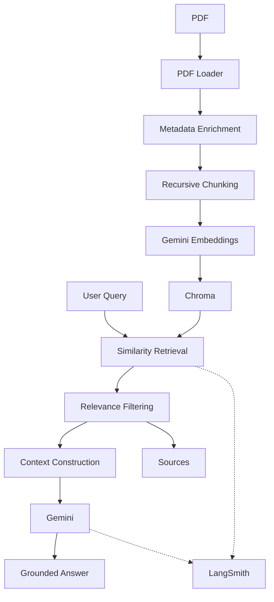
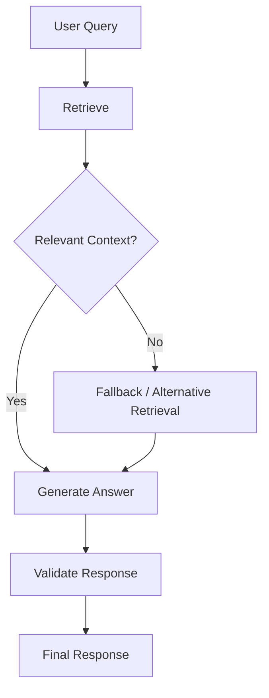

# Enterprise Documentation Assistant — Implementation Plan

## 1. Project Goal

Build an enterprise-style documentation assistant that allows users to ingest documentation and ask questions about the uploaded knowledge base.

The project is intended to demonstrate practical experience with:

- LLM applications
- Retrieval-Augmented Generation
- document ingestion
- embeddings
- vector search
- metadata-aware retrieval
- source attribution
- LangChain
- LangSmith
- LangGraph
- FastAPI
- testing
- production-oriented Python architecture

The project is being developed incrementally. Each major technology is introduced only when the previous layer is working and understood.

---

# 2. Development Philosophy

The project follows this progression:

```text
Project Setup
    ↓
LLM
    ↓
LangSmith
    ↓
Document Ingestion
    ↓
Chunking
    ↓
Embeddings
    ↓
Vector Store
    ↓
Retrieval
    ↓
2-Step RAG
    ↓
RAG Evaluation
    ↓
Conversation Memory
    ↓
LangGraph
    ↓
FastAPI
    ↓
Docker / Deployment
```

The goal is not to maximize the number of technologies.

The goal is to build a system that can be explained and defended technically in an interview.

---

# 3. Completed Milestones

## Milestone 0 — Repository and Development Setup

Status: **Completed**

Implemented:

- GitHub repository
- Python 3.12
- uv package management
- virtual environment
- `pyproject.toml`
- `uv.lock`
- `.gitignore`
- `.env.example`
- README
- LICENSE
- pytest
- Ruff
- basic application structure

The project uses dependency locking through `uv.lock`.

---

# 4. Configuration

Status: **Completed**

Implemented:

- Pydantic Settings
- `.env` based configuration
- `.env.example`
- separation of secrets from source code
- typed application settings

Current configuration includes:

```text
LLM_PROVIDER
LLM_MODEL
LLM_API_KEY

EMBEDDING_MODEL

LANGSMITH_TRACING
LANGSMITH_API_KEY
LANGSMITH_PROJECT
```

The configuration layer is kept separate from application logic.

---

# 5. LLM Integration

Status: **Completed**

Current provider:

```text
Google Gemini
```

Current generation model:

```text
gemini-2.5-flash
```

Implemented:

- LangChain LLM integration
- Gemini model invocation
- system prompts
- basic CLI execution
- initial error/configuration validation

The LLM service is isolated from the rest of the application so the RAG layer does not directly depend on the provider implementation.

---

# 6. LangSmith Observability

Status: **Completed**

LangSmith was introduced during the early LLM stage rather than being added after the RAG system was completed.

Current tracing covers:

- LLM calls
- RAG execution
- tags
- metadata
- development/debugging information

Current trace metadata includes information such as:

```text
component
environment
```

Sensitive values such as API keys are not included in custom metadata.

---

# 7. Document Ingestion

Status: **Completed**

Current supported document type:

```text
PDF
```

Implemented:

```text
PDF
 ↓
PyPDFLoader
 ↓
LangChain Documents
```

Metadata added during ingestion includes:

```text
document_id
file_name
source
page_number
```

A single `document_id` represents the original document, while individual chunks receive their own `chunk_id`.

---

# 8. Document Chunking

Status: **Completed**

Current splitter:

```text
RecursiveCharacterTextSplitter
```

Initial configuration:

```text
chunk_size = 1000
chunk_overlap = 200
```

These values are currently treated as initial configuration rather than final optimized values.

Current pipeline:

```text
Document
 ↓
Page-level content
 ↓
Recursive text splitting
 ↓
Chunks
 ↓
Metadata preserved
```

---

# 9. Embeddings

Status: **Completed**

Current embedding model:

```text
gemini-embedding-001
```

Embeddings are generated through the Google integration already used for the LLM.

Current pipeline:

```text
Chunk
 ↓
Gemini Embedding Model
 ↓
Vector representation
```

---

# 10. Vector Store

Status: **Completed**

Selected vector store:

```text
Chroma
```

Reason for choosing Chroma:

- simple local development
- persistent storage
- metadata support
- straightforward LangChain integration
- sufficient for the current project
- avoids introducing managed infrastructure before it is needed

Pinecone remains a reasonable production-oriented alternative, but Chroma is currently sufficient for the project's learning and portfolio goals.

Current storage:

```text
.chroma/
```

The generated vector database is excluded from Git.

---

# 11. Retrieval

Status: **Completed**

Current retrieval strategy:

```text
Similarity Search
```

Current behavior:

- top-k retrieval
- metadata filtering
- document-level filtering using `document_id`
- relevance score threshold

Current retrieval flow:

```text
User Query
 ↓
Embedding
 ↓
Chroma Similarity Search
 ↓
Relevance Filtering
 ↓
Relevant Documents
```

The current relevance threshold is an initial value and will be evaluated rather than assumed to be optimal.

---

# 12. Two-Step RAG

Status: **Completed**

The project now has a working basic RAG pipeline.

Current architecture:

```text
User Question
      ↓
Retrieval
      ↓
Relevant Chunks
      ↓
Context Construction
      ↓
Gemini
      ↓
Grounded Answer
      ↓
Sources
```

The LLM is instructed to answer using only the supplied documentation context.

If the retrieved context does not contain enough information, the system is instructed to state that it does not have enough information instead of relying on outside knowledge.

---

# 13. Source Attribution

Status: **Completed**

The RAG response currently contains:

```text
answer
sources
```

Source metadata includes information such as:

```text
file_name
page_number
document_id
chunk_id
```

This provides the foundation for proper document citations when the HTTP API is introduced later.

---

# 14. Current Architecture



---

# 15. Current Repository Structure

```text
enterprise-documentation-assistant/
│
├── app/
│   ├── __init__.py
│   ├── cli.py
│   ├── config.py
│   │
│   ├── llm/
│   │   ├── __init__.py
│   │   ├── prompts.py
│   │   └── service.py
│   │
│   ├── ingestion/
│   │   ├── __init__.py
│   │   ├── loader.py
│   │   ├── splitter.py
│   │   └── service.py
│   │
│   ├── embeddings/
│   │   ├── __init__.py
│   │   └── service.py
│   │
│   ├── vector_store/
│   │   ├── __init__.py
│   │   ├── chroma.py
│   │   └── service.py
│   │
│   ├── retrieval/
│   │   ├── __init__.py
│   │   ├── service.py
│   │   └── cli.py
│   │
│   └── rag/
│       ├── __init__.py
│       ├── prompts.py
│       ├── service.py
│       └── cli.py
│
├── tests/
├── docs/
├── .env
├── .env.example
├── .gitignore
├── .python-version
├── LICENSE
├── README.md
├── pyproject.toml
└── uv.lock
```

---

# 16. Next Milestone — RAG Evaluation

Status: **Next**

Before adding more architecture, evaluate whether the current RAG system actually works well.

Create a small curated evaluation dataset containing questions based on known documents.

Evaluate:

- retrieval relevance
- answer correctness
- source correctness
- ability to reject unsupported questions
- hallucination behavior

The first evaluation does not need to be a sophisticated research framework.

A practical dataset and repeatable evaluation process is enough.

---

# 17. Retrieval Improvements

Status: **Planned**

After evaluation, identify actual retrieval weaknesses.

Possible improvements include:

- better chunking configuration
- retrieval threshold tuning
- metadata filtering
- reranking
- query rewriting
- improved context construction

Do not implement all of these automatically.

The evaluation results should determine which improvement is justified.

---

# 18. Conversation Memory

Status: **Planned**

Add conversation-aware question answering.

Example:

```text
User:
What does the leave policy say?

Assistant:
...

User:
What about contractors?
```

The second question should be interpreted using the conversation context.

The implementation should distinguish:

```text
Conversation history
        +
Current question
        +
Retrieved documentation
```

from simply dumping an unlimited chat history into every prompt.

---

# 19. LangGraph

Status: **Planned**

LangGraph will be introduced only after the basic RAG pipeline and evaluation are stable.

The graph should solve an actual orchestration problem.

Potential flow:



The final graph will be determined by the actual requirements discovered during evaluation.

LangGraph should demonstrate useful stateful orchestration rather than simply replacing straightforward function calls.

---

# 20. FastAPI

Status: **Planned**

FastAPI will be introduced after the core RAG/LangGraph application is stable.

The API will expose the existing application services rather than moving business logic into route handlers.

Expected capabilities:

```text
Document ingestion
Document listing
Document deletion

Question answering
Conversation management
```

The API will include:

- Pydantic request/response models
- validation
- HTTP error handling
- service layer
- file upload handling
- conversation/session IDs
- API documentation

Authentication will initially remain limited to what is appropriate for a portfolio project.

---

# 21. Docker

Status: **Planned**

Docker will be added after the application architecture stabilizes.

Planned:

- Dockerfile
- `.dockerignore`
- environment configuration
- local container execution
- production-oriented container considerations

Chroma will initially remain external to the application container through its persisted storage approach rather than introducing unnecessary infrastructure.

---

# 22. Frontend

Status: **Not yet decided**

A frontend is not currently required for the core project.

The backend/RAG system itself is sufficient to demonstrate the main engineering work.

If a frontend is added later, it should remain small and focused on:

- document upload
- question input
- answer display
- source display
- conversation history

Streamlit is intentionally not part of the project.

---

# 23. Testing Plan

Current testing covers the configuration, ingestion/chunking, and application-level behavior.

Future testing will expand into:

### Unit Tests

- metadata handling
- chunking
- retrieval logic
- prompt construction
- output parsing
- utility functions

### Integration Tests

- document ingestion
- embedding generation
- vector store interaction
- retrieval
- RAG execution
- LangGraph execution

### Evaluation

- retrieval relevance
- answer correctness
- source correctness
- unsupported-question handling
- hallucination behavior

External API calls should not become mandatory for every normal unit-test run.

---

# 24. Security Plan

Current MVP considerations:

- API keys stored in `.env`
- `.env` excluded from Git
- no secrets in source code
- no secrets in trace metadata
- document file validation
- basic file handling

Future production hardening can include:

- authentication and authorization
- file-size limits
- stricter file validation
- rate limiting
- malicious document handling
- prompt injection defenses
- indirect prompt injection defenses
- secure document isolation
- production secret management
- SSRF protection if external retrieval is introduced

---

# 25. Git Strategy

Commits should represent meaningful implementation milestones.

Completed examples:

```text
chore: initialize project
chore: establish project structure
feat: add gemini llm integration with langsmith tracing
feat: implement document ingestion and chunking
feat: add embeddings and chroma vector retrieval
feat: implement grounded two-step rag
```

Future commits should follow the same approach.

Avoid commits for every minor file modification.

---

# 26. Immediate Roadmap

The remaining implementation order is:

```text
COMPLETED
────────────────────────────
Project setup
Configuration
Gemini integration
LangSmith
PDF ingestion
Chunking
Embeddings
Chroma
Retrieval
Metadata filtering
Two-step RAG
Source attribution
────────────────────────────

NEXT
────────────────────────────
RAG evaluation
Retrieval quality improvements
Conversation memory
LangGraph
FastAPI
Docker
Optional lightweight frontend
────────────────────────────
```

---

# 27. Current Definition of the Project

At the current milestone, the project is no longer just an LLM demo or vector database demo.

It has a complete basic RAG path:

```text
Document
   ↓
Ingestion
   ↓
Chunking
   ↓
Embeddings
   ↓
Vector Store
   ↓
Retrieval
   ↓
Context
   ↓
LLM
   ↓
Grounded Answer
   ↓
Sources
```

The next priority is **measuring and improving the quality of this pipeline** before adding more architectural components.
